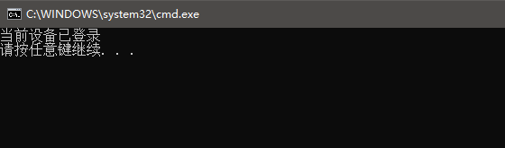
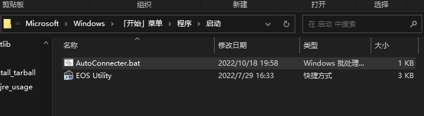

<p align="center">
  
  <h1 align="center" style="margin: 0 auto 0 auto;">School Network AutoConnecter</h1>
</p>
<br>
<p align="center">
  
  
  
<p>

### 用于解决大学校园网自动登录的解决方案，实现自动化登录流程，避免每天的重复劳动，保护身心健康

<br>

## 一. 准备
从github上Clone仓库到本地或者下载已发布版本
```Power shell
git clone https://github.com/YINGHAIDADA/School_Network_AutoConnecter.git
```
> 注意：要使用本项目的 `Python` 脚本必须保证本地逸安装 `Python3.9`的运行环境，未安装请自行百度安装

安装依赖 `pip` 包：
```Power shell
pip install -r requirements.txt
```
---
<br>

## 二. 配置

根据自己学校信息，修改 `AutoConnecter.bat` 文件
```bat
@echo off

cd /d %~dp0
python AutoConnect.py脚本绝对路径 校园网网址 登录用户名 密码
```
示例：
```bat
@echo off

cd /d %~dp0
python E:\PythonProjects\School_Network_AutoConnecter\AutoConnect.py 172.16.253.3 E204561 mima123456
```

> ### 如何检测是否有效
在脚本后面加上一行,**`示例`**：
```bat
@echo off

cd /d %~dp0
python E:\PythonProjects\School_Network_AutoConnecter\AutoConnect.py 172.16.253.3 E204561 mima123456
pause
```
运行`bat`查看结果,正常会有结果返回  
测试成功后记得删除`pause`代码  

---
<br>

## 三. 设置开机自启动

将修改好的 `AutoConnecter.bat` 文件复制到：
```cmd
C:\Users\你的用户名\AppData\Roaming\Microsoft\Windows\Start Menu\Programs\Startup
``` 


到此已经设置完成！
