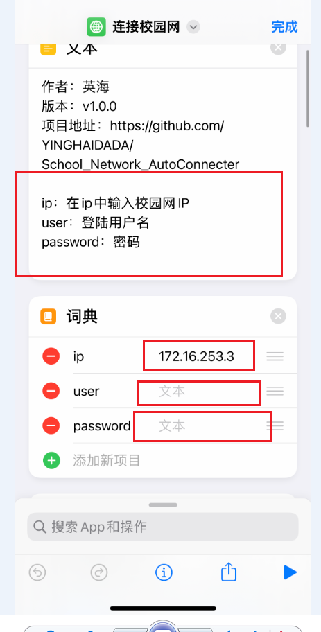

<p align="center">
  
  <h1 align="center" style="margin: 0 auto 0 auto;">School Network AutoConnecter</h1>
</p>
<br>
<p align="center">
  
  
  
  
<p>

### 用于解决大学校园网自动登录的解决方案，实现自动化登录流程，避免每天的重复劳动，保护身心健康

**目录：**
- [一. 准备](#一-准备)
- [二. 配置](#二-配置)
  - [1. 电脑(PC)有线网络和`Wi-Fi`连接](#1-电脑pc有线网络和wi-fi连接)
  - [2. 移动设备(iOS/iPadOS)](#2-移动设备iosipados)
- [三. 设置电脑(PC)开机自启动](#三-设置电脑pc开机自启动)

<br>

## 一. 准备
从github上Clone仓库到本地或者下载已发布版本
```Power shell
git clone https://github.com/YINGHAIDADA/School_Network_AutoConnecter.git
```
> 注意：要使用本项目的 `Python` 脚本必须保证本地逸安装 `Python3.9`的运行环境，未安装请自行百度安装

安装依赖 `pip` 包：
```Power shell
pip install -r requirements.txt
```
---
<br>

## 二. 配置

> 首先先自行排除一些问题，比如校园网是否欠费，原本是否正常可用，本脚本只建立在你的校园网本身是正常可用的状态

### 1. 电脑(PC)有线网络和`Wi-Fi`连接
> `Wi-Fi`要确保已连接上`WiFi`,第一次可设置`wifi自动连接`，后续就不用麻烦了

根据自己学校信息，修改 `AutoConnecter.bat` 文件
```bat
@echo off

cd /d %~dp0
python AutoConnect.py脚本绝对路径 校园网网址 登录用户名 密码
```
示例：
```bat
@echo off

cd /d %~dp0
python E:\PythonProjects\School_Network_AutoConnecter\AutoConnect.py 172.16.253.3 E204561 mima123456
```
> **如何检测是否有效**

在脚本后面加上一行,**`示例`**：
```bat
@echo off

cd /d %~dp0
python E:\PythonProjects\School_Network_AutoConnecter\AutoConnect.py 172.16.253.3 E204561 mima123456
pause
```

> 运行`bat`查看结果,正常会有结果返回  
> 测试成功后记得删除`pause`代码  
> 
  
> ### 如果报错，如何自检
> [点击访问Debug文件](doc/debug.md)

### 2. 移动设备(iOS/iPadOS)

> 确保你的设备里已经安装了`快捷指令`

打开此链接,添加我制作的`快捷指令`

```url
https://www.icloud.com/shortcuts/9d9923eb7ed04f718db39c32a5e3f656
```
> 按照教程填入对应信息



> 完成后保存

> 再添加个人自动化
> 
> 其中`无线网`选择自己想要自动连接的`校园无线网`


> 最终效果


---
<br>

## 三. 设置电脑(PC)开机自启动

将修改好的 `AutoConnecter.bat` 文件复制到：
```cmd
C:\Users\你的用户名\AppData\Roaming\Microsoft\Windows\Start Menu\Programs\Startup
``` 


到此已经设置完成！
